## Project: Build a Traffic Sign Recognition Program

**The steps for recognizing Traffic-Sign are the following:**

* Load the data set (see below for links to the project data set)

* Explore, summarize and visualize the data set

* Design, train and test a model architecture

* Use the model to make predictions on new images

* Analyze the softmax probabilities of the new images

* Summarize the results with a written report

### Loading the dataset
* The traffic-sign classifier data is stored in directory called **traffic-signs-data**

* Load the data using pickle module.

* The data comes with three section **training set** , **validation set**  and **test set**. 

* But every data set has four keys and we only need features and labels from each set

* Then I store the training data in X_train and y_train for features and labels respectively.

* Used same technique for validation set and test set also.

### Exploring the dataset and visulazie some features 
* For exploring the dataset I used pandas,numpy and collection module and for visualization I used matplotlib.pyplot module .
* The python inbuilt len() function is used to see the sizes of the datasets.
* number of example in training set : 34799
* number of example in validation set : 4410
* number of example in test set : 12630
* Then I used numpy's shape method to get the shape of the data sets as the datasets are in numpy.ndarray class format.
* Each dataset has shape of 4-d tensor . The first number is the number of example which I already obtained by len() function.
* The last three numbers describing the image shape are height,width and color channel respectively.
* All the images are in 32x32x3 shape .
* The plot_image() function gives a 4x4 grid of randomly selected images from training data .
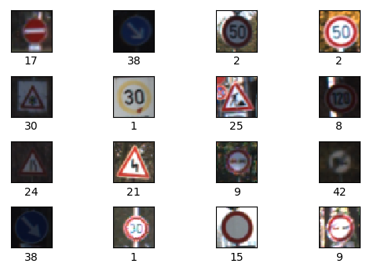

* Then I print the classes of the labels associated with each 16 images.
* The traffic sign data has total 43 classes and each class has different number of examples ranging from approximately 
150 to 2000. 
* We can see the number of examples in each classes by using the Counter() object.
* Then I visualized the discrepency in the dataset using a bar plot . Each column gives the number of examples in that class.
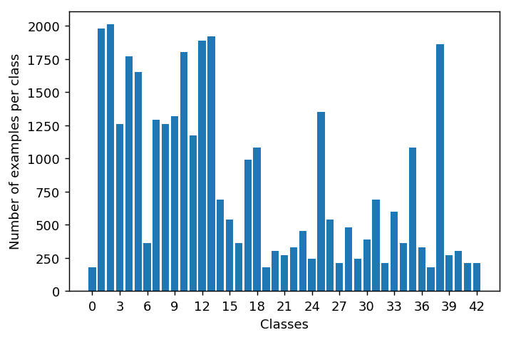

### Preprocessing the dataset

**Augmentation of the dataset**
There are many good choices for augmenting the dataset such as adding random contrast or brighness or random flipping by 
left or right . Here I use random brightness to augment the data . I use tensorflow's tf.image.random_brightness() function 
and then evaluate it . 
Then I concat the this new dataset with training data. So the new training size is double than the previous . 
Some of the new images after adding distortions :
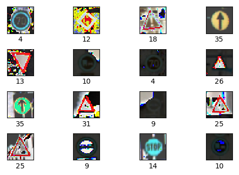

Here I have written 3 functions : 

          1. gray_scale(): Takes a list of images as input and output a 32*32*1 grayscale image .
          2. normalizer(): Min-Max scaling function.
          3. normalizer_new() : To make the data with zero mean and stddev = 1 .
          
There are many different ways to preprocess the data but I found that mean centred with standard deviation of 1 is the one of good choice to normalize the data . I used all the color channels. By using the normalizer_new() function I get the desired result .
Then I concat the distorted training data with original training data.
Then I shuffled all the training data using scikit-learn's shuffle() function.

### Defining the model for training
I used a model architecture :

    * Here I used a self defined model .It is six networks deep . 
    * It consists of 3 convolution layer and 3 fully connected layer . 
    * The last layer is of 43 neurons to classify 43 classes.
    * In every convolutional layer I used a maxpooling of 2*2 with stride = 1.
    * At third convolutional layer I added dropout of 40% which kept the model from being overfitted.
    * Then I flattened the layer with tf.contrib.layers.flatten() function . 
    * Then I used softmax probability to find out the  probabilities of each classes. 
    * The index with highest probability gives the class number .
   
                                         ----------------------------------
                                         |  fully connected layer [43]    |
                                         ----------------------------------
                                                         ||
                                         ----------------------------------
                                         |   fully connected layer[120]   |
                                         ----------------------------------
                                                         ||
                                         ----------------------------------
                                         |   fully connected layer [400]  |
                                         ----------------------------------
                                                         ||
                                         ----------------------------------
                                         |        dropout[0.4]            |
                                         |    max_pool[2x2/1][valid]      |
                                         | convolution[5x5x256/1][valid]  |
                                         ----------------------------------
                                                         ||
                                         ----------------------------------
                                         |    max_pool[2x2/1][valid]      |
                                         | convolution[5x5x128/1][valid]  |
                                         ----------------------------------
                                                         ||
                                         ----------------------------------
                                         |    max_pool[2x2/1][valid]      |
                                         |  convolution[3x3x32/1][valid]  | 
                                         ----------------------------------
                                                         ||
                                         ----------------------------------
                                         |         input[32x32x3]         |
                                         ----------------------------------
 
 I created three placeholder varibles x (num_of_image*height*width*3) and y (num. of images) and y_one_hot to encode 
 y as one hot encoded.
 The softmax_prob,model_prediction and actual_value variables would be used later to evaluate the softmax probabilities,
 prediction by the model and its actual values respectively on the new test images.
 
 Here I used the cross entropy function to measure the loss . And our optimization technique always tries to minimize the cross entropy to zero . Here we use tf.nn.softmax_cross_entropy_with_logits() function to evaluate the cross entropy .
 
 To optimize the cost function I used AdamOptimizer. Throughout all the training I used a learning_rate = 0.001
 
 ### The Confusion Matrix:
 This gives a clear idea of what the model's predition performance .
                                         
 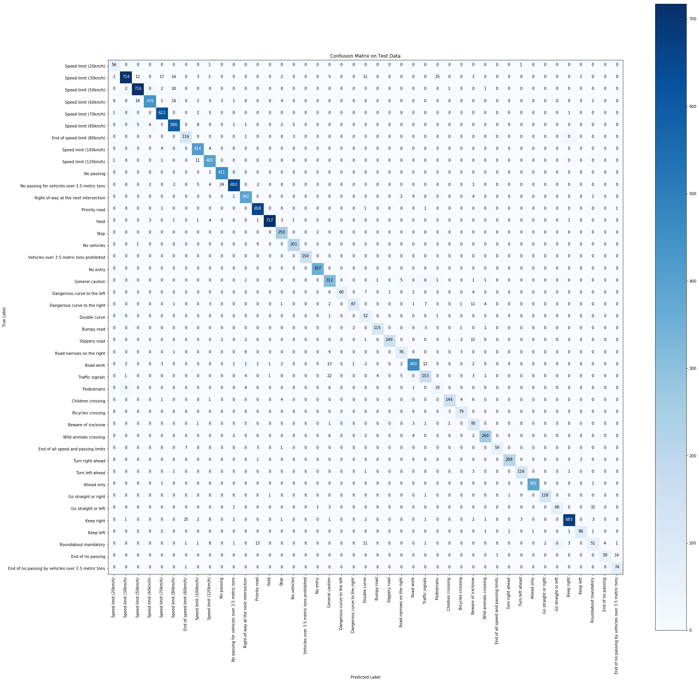 
 
 ## Test the Model on New Images

#### These are the five german traffic sign images I found on the web . 

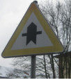

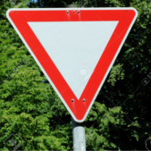

Here are the results of the prediction:

| Image			        |     Prediction	        					| 
|:---------------------:|:---------------------------------------------:|
| Road Work	      		| Road Work				 				|
| Turn right ahead	| Turn right ahead      							|
| Yield					| Yield											|
| No Entry      		| Stop sign   									| 
| Priority Road   			| General caution 										|

The model was able to correctly guess 3 of the 5 traffic signs, which gives an accuracy of 60%. This compares fair to the accuracy on the test set of 93.8% .

### For the image sign Road work ...(Correctly Predicted)
The model is perfectly sure that this is a Road work sign (probability of 0.9999), and the image does contain a Road work sign. The top five soft max probabilities were

|  Prediction        	|     Probability        					| 
|:---------------------:|:---------------------------------------------:| 
|             Road work  | 9.999995e-01     |
|         Slippery road  | 5.349513e-07     |
|     Bicycles crossing  | 4.380856e-09     |
|    Beware of ice/snow  | 3.452387e-09     |
|  Go straight or right  | 1.411123e-09     |

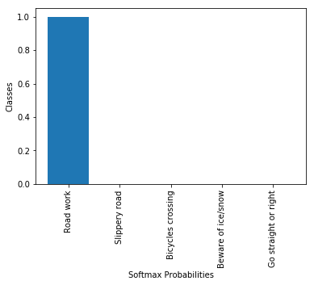

### For the image sign Turn right ahead ...(Correctly Predicted)
The model is relatively sure that this is a **Speed limit (30km/h)** sign (probability of 0.99), and the image does 
contain a Turn Right Ahead sign. But as there is no image with the top five predictions it used next probability in 
the softmax layer to identify it's as a **Turn Right Ahead** image .The top five soft max probabilities were...

| Prediction         	|     Probability	        					| 
|:---------------------:|:---------------------------------------------:| 
| Speed limit (30km/h)  |    0.990222    |
|                Yield  |    0.004425    |
|      Turn left ahead  |    0.002943    |
|           Ahead only  |    0.001359    |
| Roundabout mandatory  |    0.000925    |

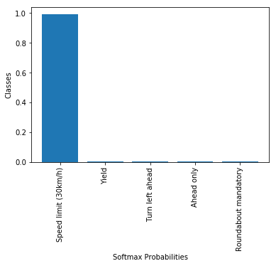

### For the image sign yield...(Correctly Predicted)
The model is absolutely sure that this is a yield sign (probability of 1.0), and the image does contain a yield sign. The top five soft max probabilities were

| Prediction         	|     Probability	        					| 
|:---------------------:|:---------------------------------------------:| 
|                                              Yield |  1.000000e+00   |
|       No passing for vehicles over 3.5 metric tons |  1.748955e-12   |
|                                    Turn left ahead |  4.124270e-15   |
|  End of no passing by vehicles over 3.5 metric ... |  1.451681e-15   |
|                                         Keep right |  7.540276e-17   |

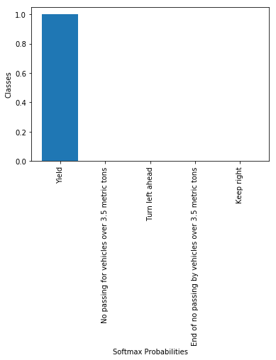

### For the image sign Priority road... (Worngly Predicted)
The model is relatively sure that this is a **Go straight or left** sign (probability of 0.6), and the image does contain a **Priority Road** sign. The top five soft max probabilities were
| Prediction         	|     Probability	        					| 
|:---------------------:|:---------------------------------------------:| 
|    Go straight or left  |     0.541098        |
|        General caution  |     0.429022        |
|        Traffic signals  |     0.024712        |
|  Wild animals crossing  |     0.005072        |
|              Road work  |     0.000087        |

### For the image sign No entry ... (Worngly Predicted)
The model is relatively sure that this is a **Stop** sign (probability of 0.62), and the image does contain a **No Entry** sign. The top five soft max probabilities were

|  Prediction       	|     Probability       					| 
|:---------------------:|:---------------------------------------------:| 
|                                        Stop |  6.232601e-01  |
|No passing for vehicles over 3.5 metric tons |  2.725155e-01  |
|                                       Yield |  1.042178e-01  |
|                        Speed limit (80km/h) |  6.453646e-06  |
|                          Beware of ice/snow |  4.445295e-08  |

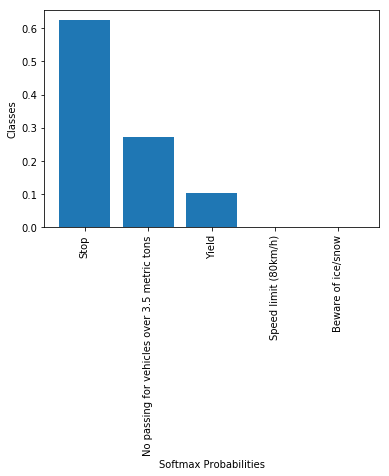

From the above prediction we can realize that for Road Work (label = 25) and for yield(label = 13) the number of examples in these classes is much higher, nearabout 2500,3800 respectively in augmented training set . And it is the case for deep network . With higher training data comes great accuracy .

### Visualizing the Neural Network

Here we plot the first convolutional layer with relu activation with the help of given OutputFeatureMap() function . A 3*3 
filter of depth 32 is applied . We can see the 32 different outputs when a 3*3 filter with stride 1 is applied to road work
sign image . Here the weights are random truncated numbers with normal distribution. The weights initialization is a in depth research topic .

The next levels are much more difficult to understand for it's higher dimensionality hence omitted.
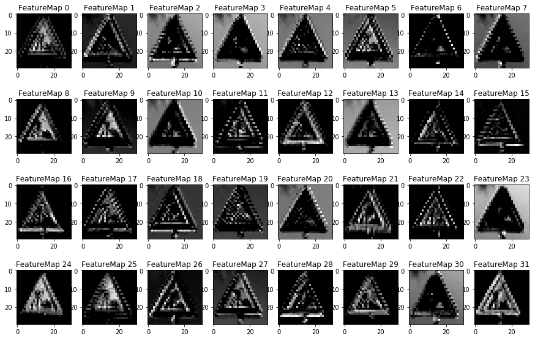
