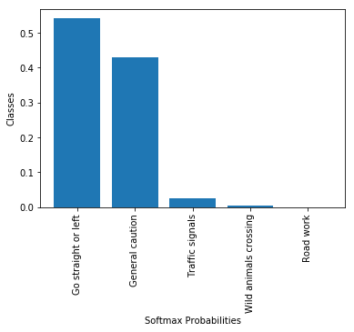

## Project: Build a Traffic Sign Recognition Program

**The steps for recognizing Traffic-Sign are the following:**

* Load the data set (see below for links to the project data set)

* Explore, summarize and visualize the data set

* Design, train and test a model architecture

* Use the model to make predictions on new images

* Analyze the softmax probabilities of the new images

* Summarize the results with a written report

### Loading the dataset
* The traffic-sign classifier data is stored in directory called **traffic-signs-data**

* Load the data using pickle module.

* The data comes with three section **training set** , **validation set**  and **test set**. 

* But every data set has four keys and we only need features and labels from each set

* Then I store the training data in X_train and y_train for features and labels respectively.

* Used same technique for validation set and test set also.

### Exploring the dataset and visulazie some features 
For exploring the dataset I used pandas,numpy and collection module and for visualization 
I used matplotlib.pyplot module .
The python inbuilt len() function is used to see the sizes of the datasets.
number of example in training set
number of example in validation set
number of example in test set
Then I used numpy's shape method to get the shape of the data sets as the datasets are in numpy.ndarray class format.
Each dataset has shape of 4-d tensor . The first number is the number of example which I already obtained by len() function.
The last three numbers describing the image shape are height,width and color channel respectively.
All the images are in 32x32x3 shape .
The plot_image() function gives a 4x4 grid of randomly selected 

Then I print the classes of the labels associated with each 16 images.
The traffic sign data has total 43 classes and each class has different number of examples ranging from approximately 
150 to 2000. We can see the number of examples in each classes by using the Counter() object.
Then I visualized the discrepency in the dataset using a bar plot . Each column gives the number of examples in that class.

### Preprocessing the dataset

**Augmentation of the dataset**
There are many good choices for augmenting the dataset such as adding random contrast or brighness or random flipping by 
left or right . Here I use random brightness to augment the data . I use tensorflow's tf.image.random_brightness() function 
and then evaluate it . 
Then I concat the this new dataset with training data. So the new training size is double than the previous . 
Some of the new images after adding distortions :

There are many different ways to preprocess the data but I found that mean centred with standard deviation of 1 is the one of
good choice to normalize the data . I used all the color channels. By using the normalizer() function I get the desired result .
Then I shuffled all the training data using scikit-learn's shuffle() function.

### Defining the model for training
I used a model architecture :

| Layer         		|     Description	        					| 
|:---------------------:|:---------------------------------------------:| 
| Input         		| 32x32x3 RGB image   							| 
| Convolution 3x3     	| 1x1 stride, same padding, outputs 32x32x64 	|
| RELU					|												|
| Max pooling	      	| 2x2 stride,  outputs 16x16x64 				|
| Convolution 3x3	    | etc.      									|
| Fully connected		| etc.        									|
| Softmax				| etc.        									|
|						|												|
|						|												|
                                         
                                         ----------------------------------
                                         |        softmax layer [43] 
                                         ----------------------------------
                                                         ||
                                         ----------------------------------
                                         |   fully connected layer[120]   |
                                         ----------------------------------
                                                         ||
                                         ----------------------------------
                                         |   fully connected layer [400]  |
                                         ----------------------------------
                                                         ||
                                         ----------------------------------
                                         |        dropout[0.4]            |
                                         |    max_pool[2x2/1][valid]      |
                                         | convolution[5x5x256/1][valid]  |
                                         ----------------------------------
                                                         ||
                                         ----------------------------------
                                         |    max_pool[2x2/1][valid]      |
                                         | convolution[5x5x128/1][valid]  |
                                         ----------------------------------
                                                         ||
                                         ----------------------------------
                                         |    max_pool[2x2/1][valid]      |
                                         |  convolution[3x3x32/1][valid]  | 
                                         ----------------------------------
                                                         ||
                                         ----------------------------------
                                         |         input[32x32x3]         |
                                         ----------------------------------
                                         
  
 
 ###Test a Model on New Images

####1. Choose five German traffic signs found on the web and provide them in the report. For each image, discuss what quality or qualities might be difficult to classify.

Here are five German traffic signs that I found on the web:

The first image might be difficult to classify because ...

####2. Discuss the model's predictions on these new traffic signs and compare the results to predicting on the test set. At a minimum, discuss what the predictions were, the accuracy on these new predictions, and compare the accuracy to the accuracy on the test set

Here are the results of the prediction:

| Image			        |     Prediction	        					| 
|:---------------------:|:---------------------------------------------:|
| Road Work	      		| Road Work				 				|
| Turn right ahead	| Turn right ahead      							|
| Yield					| Yield											|
| No Entry      		| Stop sign   									| 
| Priority Road   			| General caution 										|

The model was able to correctly guess 3 of the 5 traffic signs, which gives an accuracy of 60%. This compares favorably to the accuracy on the test set of 93.8% .

####3. Describe how certain the model is when predicting on each of the five new images by looking at the softmax probabilities for each prediction. Provide the top 5 softmax probabilities for each image along with the sign type of each probability. (OPTIONAL: as described in the "Stand Out Suggestions" part of the rubric, visualizations can also be provided such as bar charts)

The code for making predictions on my final model is located in the 11th cell of the Ipython notebook.

For the first image, the model is perfectly sure that this is a Road work sign (probability of 0.9999), and the image does contain a Road work sign. The top five soft max probabilities were

### For the image sign Road work ...

|  Prediction        	|     Probability        					| 
|:---------------------:|:---------------------------------------------:| 
|             Road work  | 9.999995e-01     |
|         Slippery road  | 5.349513e-07     |
|     Bicycles crossing  | 4.380856e-09     |
|    Beware of ice/snow  | 3.452387e-09     |
|  Go straight or right  | 1.411123e-09     |

For the first image, the model is relatively sure that this is a Turn Right Ahead sign (probability of 0.95), and the image does contain a Turn Right Ahead sign(probability of 0.0065). The top five soft max probabilities were...
### For the image sign Turn right ahead ...

| Prediction         	|     Probability	        					| 
|:---------------------:|:---------------------------------------------:| 
| Speed limit (30km/h)  |    0.990222    |
|                Yield  |    0.004425    |
|      Turn left ahead  |    0.002943    |
|           Ahead only  |    0.001359    |
| Roundabout mandatory  |    0.000925    |

### For the image sign yield
For the first image, the model is absolutely sure that this is a yield sign (probability of 1.0), and the image does contain a yield sign. The top five soft max probabilities were

| Prediction         	|     Probability	        					| 
|:---------------------:|:---------------------------------------------:| 
|                                              Yield |  1.000000e+00   |
|       No passing for vehicles over 3.5 metric tons |  1.748955e-12   |
|                                    Turn left ahead |  4.124270e-15   |
|  End of no passing by vehicles over 3.5 metric ... |  1.451681e-15   |
|                                         Keep right |  7.540276e-17   |

For the first image, the model is relatively sure that this is a General caution sign (probability of 0.6), and the image does contain a Priority Road sign. The top five soft max probabilities were
### For the image sign Priority road
| Prediction         	|     Probability	        					| 
|:---------------------:|:---------------------------------------------:| 
|    Go straight or left  |     0.541098        |
|        General caution  |     0.429022        |
|        Traffic signals  |     0.024712        |
|  Wild animals crossing  |     0.005072        |
|              Road work  |     0.000087        |

### For the image sign No entry
For the first image, the model is relatively sure that this is a No passing for vehicles over 3.5 metric tons sign (probability of 0.99), and the image does contain a No Entry sign. The top five soft max probabilities were

|  Prediction       	|     Probability       					| 
|:---------------------:|:---------------------------------------------:| 
|                                        Stop |  6.232601e-01  |
|No passing for vehicles over 3.5 metric tons |  2.725155e-01  |
|                                       Yield |  1.042178e-01  |
|                        Speed limit (80km/h) |  6.453646e-06  |
|                          Beware of ice/snow |  4.445295e-08  |

### (Optional) Visualizing the Neural Network (See Step 4 of the Ipython notebook for more details)
####1. Discuss the visual output of your trained network's feature maps. What characteristics did the neural network use to make classifications?

